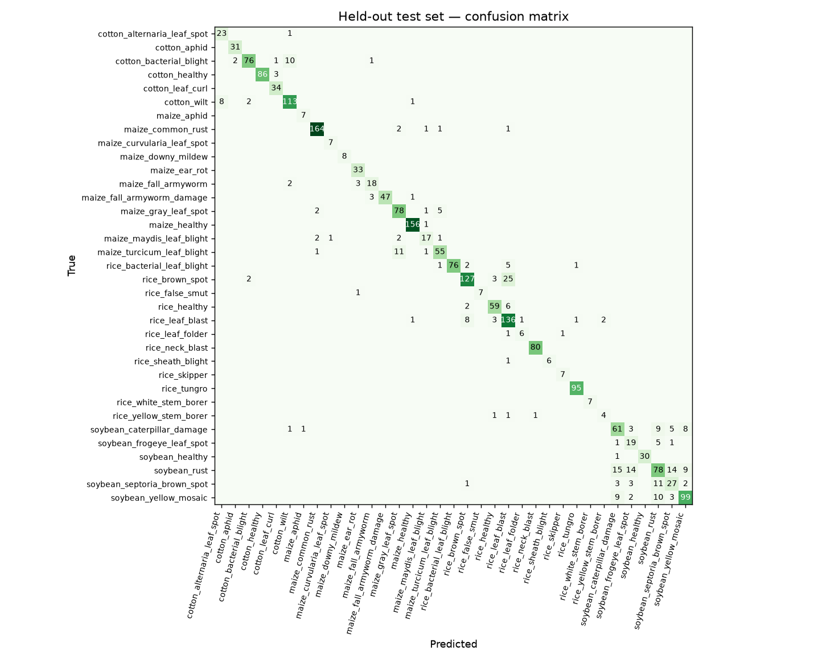
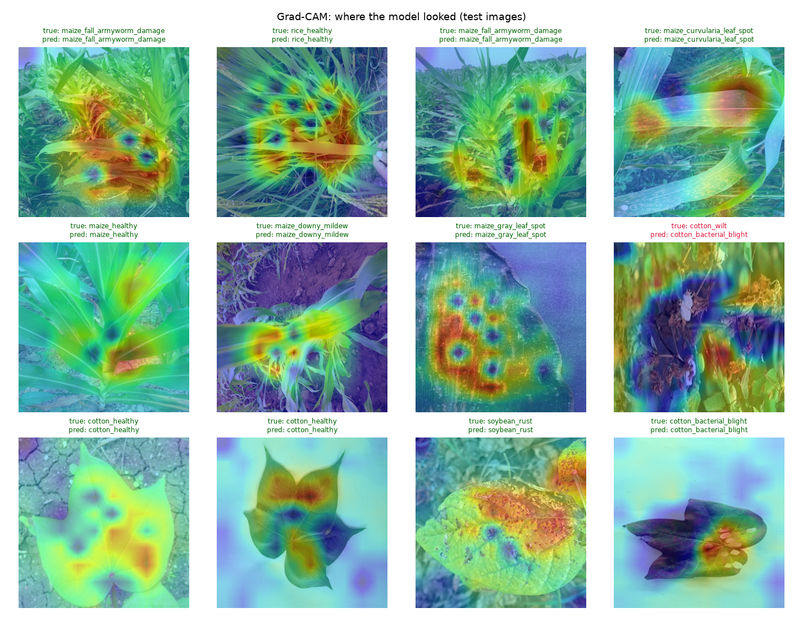

# AnnRakshak vision model — report (CANDIDATE — not deployed)

Generated 2026-09-16 09:03 UTC by `ml/train.py --with-extra`. Version `icar+extra+more-efficientnet_v2_s-warmstart-20260916`.

**Data:** ICAR rice & maize images (835 unique) + Crop Diseases compilation (rice blast, brown spot, healthy; PlantVillage maize rust, northern leaf blight, healthy) + CCMT field maize (fall armyworm, healthy); lab-backdrop photos trained with background randomisation. 35 training classes → 33 targets (rice leaf and neck blast, fall armyworm larvae and damage, are separate classes merged into one advisory target). The ICAR train/validation/test split is the one the previous model used, so the ICAR test numbers below compare like for like. Extra sources are split per class (70/15/15, seed 42) and capped (new classes ≤300 train images, classes ICAR already has ≤150); training samples classes evenly and, inside a class, gives the ICAR field photos 75% of the weight. **Warm start:** training continues from the deployed model — its backbone and its head rows for every class it already knew — at a third of the usual learning rate, so only the new classes are learnt from scratch (continual learning).

**Why background randomisation:** the extra rice photos are single leaves on white paper and the maize ones are PlantVillage leaves on black/grey — each class with its own backdrop. A network learns the backdrop. So 85% of the time in training (and always in validation) the leaf is cut out and pasted on a healthy ICAR field photo of the same crop (`ml/composite.py`). The background-swap test below pastes held-out test leaves on held-out field backgrounds: if the model had learnt backdrops, it would fail there.

## 1. ICAR field test set (same 126 images as the previous model)

| | Top-1 accuracy | Macro-F1 | Advised | Accuracy when advised | Calibration error |
|---|---|---|---|---|---|
| previous (icar+extra-efficientnet_v2_s-warmstart-20260915) | 0.889 | 0.766 | 91.3% | 0.9652 | 0.0565 |
| **this model** | 0.889 | 0.741 | 87.3% | 0.9636 | 0.0372 |

## 2. Extra-source test images

- Original backgrounds: accuracy **0.873** (2023 images); gate advises 81.4%, right 0.9387 of the time.
- Plain-backdrop images only: 0.888 on the original backdrop → **0.858** with the backdrop swapped for an unseen field photo (gate right 0.9343 of the time when it advises).

Per-class recall, background swapped:

| Class | Test images | Recall |
|---|---|---|
| cotton_alternaria_leaf_spot | 20 | 1.00 |
| cotton_aphid | 3 | 0.67 |
| cotton_bacterial_blight | 45 | 0.80 |
| cotton_healthy | 35 | 0.97 |
| cotton_leaf_curl | 7 | 1.00 |
| cotton_wilt | 89 | 0.82 |
| maize_common_rust | 115 | 0.97 |
| maize_ear_rot | 5 | 1.00 |
| maize_fall_armyworm | 3 | 0.67 |
| maize_gray_leaf_spot | 16 | 0.88 |
| maize_healthy | 49 | 0.96 |
| maize_maydis_leaf_blight | 5 | 0.60 |
| maize_turcicum_leaf_blight | 11 | 0.73 |
| rice_bacterial_leaf_blight | 7 | 0.43 |
| rice_brown_spot | 73 | 0.59 |
| rice_healthy | 60 | 0.87 |
| rice_leaf_blast | 89 | 0.84 |
| rice_neck_blast | 67 | 1.00 |
| rice_tungro | 6 | 1.00 |
| soybean_caterpillar_damage | 2 | 1.00 |
| soybean_healthy | 3 | 1.00 |
| soybean_rust | 5 | 0.40 |
| soybean_septoria_brown_spot | 6 | 0.67 |
| soybean_yellow_mosaic | 2 | 0.00 |

## 3. Deployment checks

- ✅ ICAR test top-1 within 2 points of deployed: 0.889 vs 0.889
- ✅ ICAR accuracy-when-advised within 1 point of deployed: 0.9636 vs 0.9652
- ✅ cotton_alternaria_leaf_spot recall after background swap >= 0.70: 1.000
- ✅ cotton_aphid recall on held-out photos >= 0.70: 1.000
- ✅ cotton_bacterial_blight recall after background swap >= 0.70: 0.800
- ✅ cotton_healthy recall after background swap >= 0.70: 0.971
- ✅ cotton_leaf_curl recall on held-out photos >= 0.70: 1.000
- ✅ cotton_wilt recall after background swap >= 0.70: 0.820
- ✅ maize_ear_rot recall on held-out photos >= 0.70: 1.000
- ✅ maize_gray_leaf_spot recall after background swap >= 0.70: 0.875
- ✅ rice_tungro recall on held-out photos >= 0.70: 1.000
- ❌ soybean_caterpillar_damage recall on held-out photos >= 0.70: 0.693
- ✅ soybean_frogeye_leaf_spot recall on held-out photos >= 0.70: 0.731
- ✅ soybean_healthy recall on held-out photos >= 0.70: 0.968
- ❌ soybean_rust recall on held-out photos >= 0.70: 0.600
- ❌ soybean_septoria_brown_spot recall on held-out photos >= 0.70: 0.575
- ✅ soybean_yellow_mosaic recall on held-out photos >= 0.70: 0.805

**Not deployed — the previous model stays live.**

## Read this before quoting the numbers

- The extra rice and maize photos are lab-style; field photos from farmers' phones will differ more than the swap test can show. Blast and rust are new photo classes: expert confirmations on the officials' dashboard are the field test that counts.
- The ICAR test is ~8 images per class; one image is ~12 points of per-class recall.
- The Crop Diseases download lost 1,695 relevant images to a damaged download (data/raw/crop_diseases/archive_LOST.txt); a clean re-download would add them.
