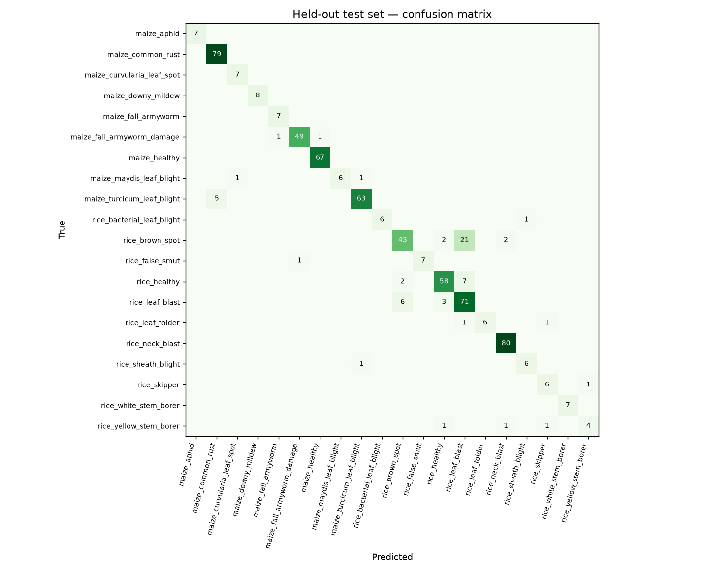
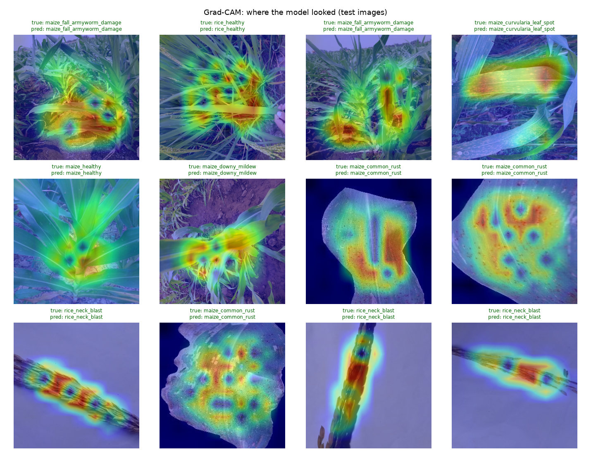

# AnnRakshak vision model — report

Generated 2026-09-15 08:37 UTC by `ml/train.py --with-extra`. Version `icar+extra-efficientnet_v2_s-warmstart-20260915`.

**Data:** ICAR rice & maize images (835 unique) + Crop Diseases compilation (rice blast, brown spot, healthy; PlantVillage maize rust, northern leaf blight, healthy) + CCMT field maize (fall armyworm, healthy); lab-backdrop photos trained with background randomisation. 20 training classes → 18 targets (rice leaf and neck blast, fall armyworm larvae and damage, are separate classes merged into one advisory target). The ICAR train/validation/test split is the one the previous model used, so the ICAR test numbers below compare like for like. Extra sources are split per class (70/15/15, seed 42) and capped (new classes ≤300 train images, classes ICAR already has ≤150); training samples classes evenly and, inside a class, gives the ICAR field photos 75% of the weight. **Warm start:** training continues from the deployed model — its backbone and its head rows for every class it already knew — at a third of the usual learning rate, so only the new classes are learnt from scratch (continual learning).

**Why background randomisation:** the extra rice photos are single leaves on white paper and the maize ones are PlantVillage leaves on black/grey — each class with its own backdrop. A network learns the backdrop. So 85% of the time in training (and always in validation) the leaf is cut out and pasted on a healthy ICAR field photo of the same crop (`ml/composite.py`). The background-swap test below pastes held-out test leaves on held-out field backgrounds: if the model had learnt backdrops, it would fail there.

## 1. ICAR field test set (same 126 images as the previous model)

| | Top-1 accuracy | Macro-F1 | Advised | Accuracy when advised | Calibration error |
|---|---|---|---|---|---|
| previous (icar-efficientnet_v2_s-finetune-20260914) | 0.897 | 0.895 | 86.5% | 0.9725 | 0.0552 |
| **this model** | 0.889 | 0.766 | 91.3% | 0.9652 | 0.0565 |

## 2. Extra-source test images

- Original backgrounds: accuracy **0.910** (522 images); gate advises 94.6%, right 0.9393 of the time.
- Plain-backdrop images only: 0.881 on the original backdrop → **0.854** with the backdrop swapped for an unseen field photo (gate right 0.9121 of the time when it advises).

Per-class recall, background swapped:

| Class | Test images | Recall |
|---|---|---|
| maize_common_rust | 66 | 1.00 |
| maize_healthy | 19 | 0.95 |
| maize_turcicum_leaf_blight | 11 | 0.91 |
| rice_brown_spot | 60 | 0.62 |
| rice_healthy | 60 | 0.65 |
| rice_leaf_blast | 79 | 0.91 |
| rice_neck_blast | 67 | 1.00 |

## 3. Deployment checks

- ✅ ICAR test top-1 within 2 points of deployed: 0.889 vs 0.897
- ✅ ICAR accuracy-when-advised within 1 point of deployed: 0.9652 vs 0.9725
- ✅ maize_common_rust recall after background swap >= 0.70: 1.000
- ✅ rice_leaf_blast recall after background swap >= 0.70: 0.911
- ✅ rice_neck_blast recall after background swap >= 0.70: 1.000

**Deployed**

## Read this before quoting the numbers

- The extra rice and maize photos are lab-style; field photos from farmers' phones will differ more than the swap test can show. Blast and rust are new photo classes: expert confirmations on the officials' dashboard are the field test that counts.
- The ICAR test is ~8 images per class; one image is ~12 points of per-class recall.
- The Crop Diseases download lost 1,695 relevant images to a damaged download (data/raw/crop_diseases/archive_LOST.txt); a clean re-download would add them.
